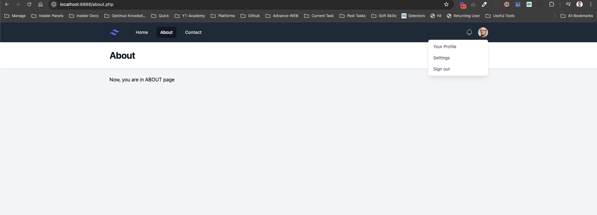
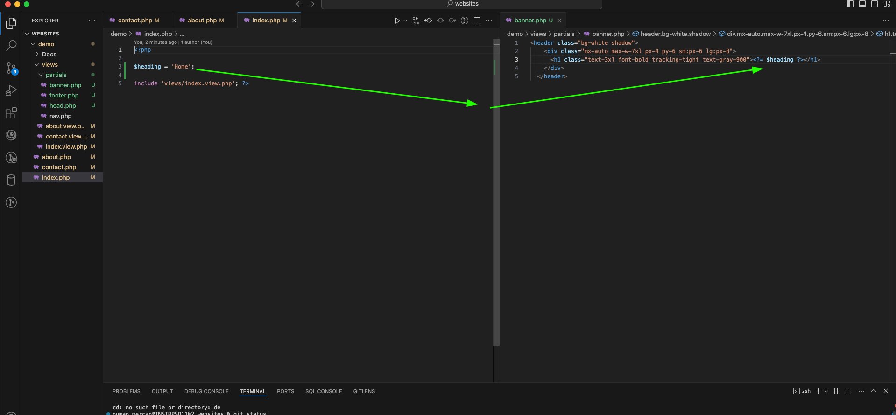

Part 1 - Page Links

home - about - contact sayfaları arasında geçiş ve sayfa değişimi

tailwind ve farklı php dosyaları arasında import 

2 - Partials

PHP içinde sayfaları ve yapıyı en optimize ve düzenlenebilir şekilde geliştirmek geliştirici için çok önemli, yoksa çok fazla tekrara ve statik yapıdan kopamayan bir koda sahip oluruz. 

Bunun için partials yani benim alıştığım dilde component yapısını kullanıyoruz, view adında bir klasör içinde çoğu sayfa için neredeyse tamamen benzer yapıları view klasörü altında tek bir komponent olarak .php yapısı oluşturup ona atarız.

Eğer o sayfa içinde sayfalara göre dinamik veriler elde edilecek bir yapı varsa şu şekilde değişkenleri kullanabiliriz.

