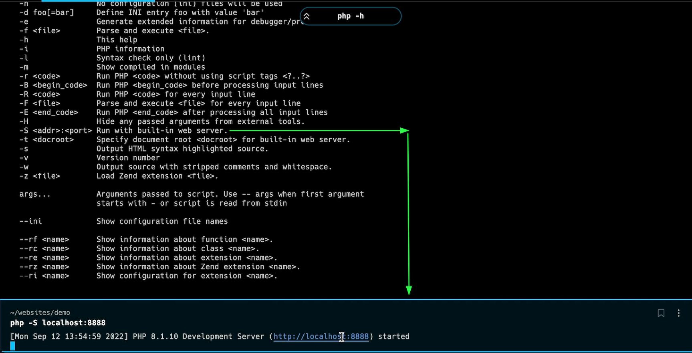

Bu sectionda hızlı şekilde PHP basic konseptleri inceledim

Önemli kısımlar:

- array_filter fonksiyonu -> filtrelemek istenen diziyi ve callback olarak filtre fonksiyonunu parametre olarak alan php fonksiyonu

- PHP de Ayrı .php sayfaları kullanmak

- PHP de local server oluşturup üzerinde çalışmak
